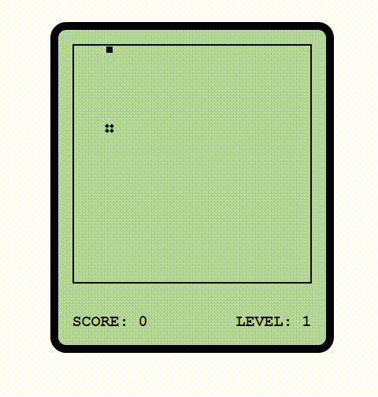

<h1 align='center'>TS版本贪吃蛇</h1>

<div align='center'>
	
	
	
</div>


## 技术栈

typescript + webpack + es6 + scss


## 前言

### 适合人群

熟练前端三件套（html css js）及 ts 基本语法


### 项目介绍

**这是一个适合typescript新手入门的一个ts版本的贪吃蛇项目 , 本项目按照面向对象的开发思想。 项目一共涉及四个类： Food类  Score类  Snake类  GameControl类， 因为项目的整体逻辑比较简单， 所以本项目并不涉及接口、泛型等高级特性（考虑后期会进行项目的升级）**


### 项目结构

````
├─ src                                    // 源码目录
│  ├── modules                              // 项目功能模块
│  │   ├── food.ts						      // 食物类
│  │   ├── gameControl.ts				      // 游戏控制类
│  │   ├── score.ts                           // 计分板类
│  │   ├── snake.ts 					      // 蛇类 （核心）
│  ├── style                                // 样式目录
│  │   ├── index.scss                         // 项目样式文件
├─ index.html                             // 项目html模板
├─ index.ts                               // 打包入口文件             
├─ .gitignore                             // git忽略文件
├─ README.md                              // 项目README
├─ screenshot                             // 项目演示截图
├─ package-lock.json                      // 项目依赖包版本管理
├─ package.json                           // 项目依赖
├─ tsconfiig.json                         // 项目typescript配置
├─ webpack.config.js                      // webpack配置
````


## 项目演示




## 项目运行

````shell
npm install    安装依赖

npm run serve  本地启动项目

npm run build  项目打包
````


## 目标功能

- [x] 蛇移动
- [x] 蛇方向控制
- [x] 食物随机生成
- [x] 蛇吃到食物增加一节
- [x] 蛇吃到食物分数增加1
- [x] 计分版每10分升一级 满级10级
- [x] 蛇撞墙检测
- [x] 蛇撞到自己检测
- [ ] 开始游戏/重新开始 弹窗按钮
- [ ] 支持游戏暂停
- [ ] 支持游戏模式选择
